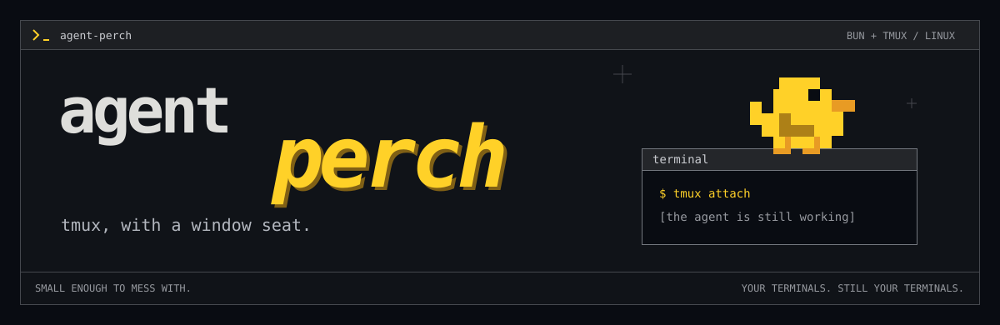
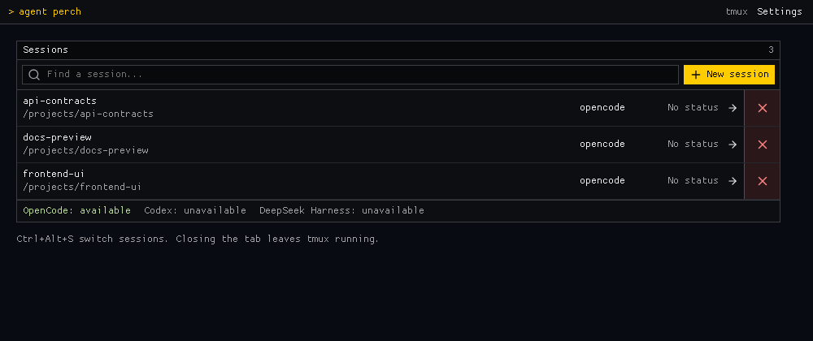
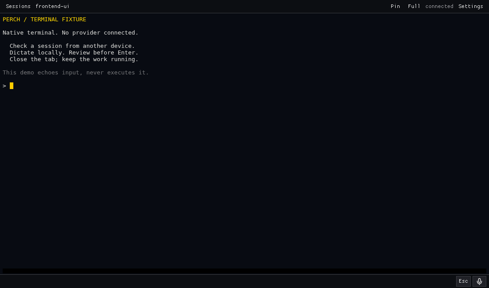
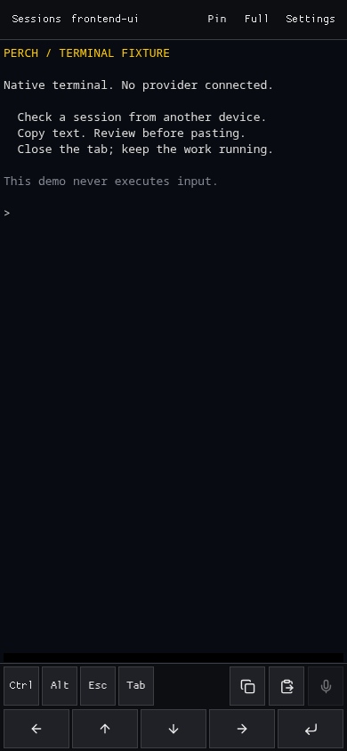

<p align="center">
  
</p>

<p align="center">
  <strong>A small, hackable browser terminal for your coding agents.</strong><br>
  OpenCode, Codex, DeepSeek Harness, Pi. Your machine. Your tmux sessions.
</p>

<p align="center">
  <code>SINGLE-USER PREVIEW</code> &nbsp; <code>LINUX + TMUX</code> &nbsp; <code>LOCAL ENGLISH SPEECH</code> &nbsp; <a href="LICENSE">MIT</a>
</p>

<p align="center">
  <a href="START_HERE.md">First run</a> &middot; <a href="#talk-to-it">Local speech</a> &middot; <a href="docs/guide.md">The manual</a> &middot; <a href="docs/verification.md">What's verified</a> &middot; <a href="CONTRIBUTING.md">Contribute</a>
</p>

For checking on the agent from the couch, without bringing the entire laptop to the couch.

Perch puts your tmux sessions in a browser. Attach to something already running, or give it a directory and start an agent there. Type, paste, switch sessions, close the tab. **The tab can leave. The agent keeps working.** An exited agent or a reboot is different; Perch does not restart the work.



> [!WARNING]
> **No built-in login. Anyone who can reach Perch can control your terminals.** Keep it on localhost or behind private HTTPS and access control. Tailscale **Serve**, not Funnel. Run it as your normal user, never root. [Security details](SECURITY.md).

## Run It

You need **Linux**, **Bun 1.3.10+**, and **tmux 3.3+**. Install and authenticate whichever agent CLI you want to launch. Existing tmux sessions work without installing another agent.

From the checkout:

```sh
bun install --frozen-lockfile
bun run build
bun run start
```

Open **http://localhost:4310/**. All four agents launch as native CLIs. No separate OpenCode API server, database integration, or session metadata to set up.

**New session** takes a path, not a pre-registered project. `/work/app`, `~/src/app`, and relative paths all work. Check the box to create a missing directory. Leave the name blank to use the directory name. No repository scaffolding or surprise `git init`.

Want it running after you log out? Stop the foreground server, then use the [systemd installer](docs/guide.md#quick-start). One service, an existing `.env` left alone, and no agent server installed behind your back.

For another device, follow the [private HTTPS setup](docs/guide.md#private-remote-access). Use a browser tab or install from your browser's menu. The host must remain reachable; Perch does not maintain an offline copy of the app.

## What You Get

| | OpenCode | Codex | DeepSeek Harness |
| --- | --- | --- | --- |
| Native terminal in the browser | Yes | Yes | Yes |
| Start in any accessible directory | Yes | Yes | Yes |
| Starting prompt from the form | Yes | Yes | Enter it in the TUI |
| Turn-finished / attention indicators | Native events | Native notifications | Native events |
| Compact / continue, approval controls | Use the TUI | Use the TUI | Use the TUI |
| Dictation and image paste | Yes | Not yet | Not yet |

**Pi** also launches as a native TUI with literal starting prompts, optional lifecycle indicators, and non-submitting image file references (not automatic image attachments). [Pi setup and limits](docs/backends.md#pi).

Session search, pins, physical keyboards, mobile touch keys, and supported clipboard text writes work across the terminal layer. **Ctrl+Alt+S** opens the switcher. Your agent's approval controls stay in its own TUI; Perch doesn't turn them off.

The **red X** beside each session opens a confirmation before killing it. Closing a browser tab still leaves the agent running; confirming **Kill session** does not.

New sessions have **native attention indicators** that stay unread until **Mark seen**. OpenCode and DSH expose lifecycle events; Codex notifications produce generic **Needs attention** indicators. Observation does not require an open viewer. Existing uninstrumented agents are left alone. **No status** is not a claim that an agent is idle. [Details and limits](docs/guide.md#agent-attention).

The compact, flat UI uses a locally served Proggy Clean font, with larger touch controls on phones. The terminal keeps its own readable, adjustable font. No web-font CDN.

[Backend setup](docs/backends.md) covers authentication and executable paths. DeepSeek uses **`dsh-tui`**, not an imaginary `deepseek` command.

<details>
<summary>Desktop and pocket-sized terminals</summary>

These captures use the current UI with isolated, inert fixtures. No provider calls or real conversations.




</details>

## Talk to It

The optional speech-to-text model runs **on the device holding the microphone**. On your phone, that means your phone, not the server or a transcription API.

We use **Moonshine v2 Medium English**, a **245M-parameter** model with **8-bit quantized weights**, through Moonshine's **multithreaded WASM/CPU** runtime in a browser worker. This is the accuracy-first option, not the smallest download. There is no cloud fallback, WebGPU requirement, or browser Web Speech service.

```text
microphone --> Moonshine in your browser --> OpenCode prompt
               audio stays here             review, then Enter
```

To enable it, run these on the host:

```sh
bun run voice:prepare
bun run build
```

Preparation downloads the pinned English model from Moonshine and copies the pinned runtime into locally served assets. The browser fetches roughly **304 MiB** of model/runtime files **from your host** on first use; model files are cached. All runtime URLs are same-origin. **Recorded audio is never uploaded by Perch.** The server supplies the cross-origin-isolation headers required by threaded WASM; a reverse proxy must preserve them.

First use remembers speech in this browser. On later visits, Perch prepares it in the background without opening the microphone. Turn off **Settings > Prepare speech on startup** to keep loading manual; dictating won't override that choice. Reloading still requires model initialization, but subsequent dictation reuses the warm model.

> [!TIP]
> **Prepare once, dictate repeatedly.** Startup is the expensive part. Use **Settings > Prepare speech** before your first recording. [Measured cold/warm timings](docs/verification.md#speech-checks) are smoke-test results, not a phone-performance promise.

Dictation currently pastes into **OpenCode only**, without submitting. The text goes to the host at that point; if you submit it, it can go to the agent's model provider. Local transcription does not make the rest of the agent local.

Recordings stop at 60 seconds. Transcription is **English-only**, regardless of browser language. Check the transcript, especially code identifiers and file paths. [How capture and cancellation work](docs/guide.md#private-voice).

## Mess With It

Perch is meant to be a small tool you can understand and change. The basic path is:

```text
browser / xterm.js  <-- WebSocket -->  Bun / PTY  <-->  tmux  <-->  agent
```

tmux owns the sessions. Perch launches a CLI and forwards terminal input/output; the agent owns everything else. No conversation discovery, compaction engine, or operation journal. Native viewer notifications replace pane polling; one server-owned loop reconciles attention observers. The manager and switcher share one session list.

| If you want to change... | Start here |
| --- | --- |
| The UI, dialogs, or colors | [`src/App.tsx`](src/App.tsx), [`src/style.css`](src/style.css) |
| Session refreshes and mutations | [`src/sessions.ts`](src/sessions.ts) |
| Terminal rendering and keys | [`src/Terminal.tsx`](src/Terminal.tsx) |
| Routes, PTYs, and session creation | [`server/index.ts`](server/index.ts) |
| Agent commands and recognition | [`server/backends.ts`](server/backends.ts) |
| Native status and attention | [`server/agent-status.ts`](server/agent-status.ts), [`integrations/`](integrations/) |
| Viewer notifications and clipboard | [`server/clipboard.ts`](server/clipboard.ts) |
| tmux and directory handling | [`server/tmux.ts`](server/tmux.ts) |
| Microphone capture / local inference | [`src/voice.ts`](src/voice.ts), [`src/voice.worker.ts`](src/voice.worker.ts) |
| Speech model and downloaded files | [`scripts/prepare-voice.ts`](scripts/prepare-voice.ts) |

```sh
bun run check
bun test --no-env-file
bun run build
```

Tests use disposable directories and separate tmux sockets. For interactive development, do the same: use a different port, `TMUX_SOCKET`, and `STATE_DIR`. Your actual work is a poor test fixture. [Development setup](docs/guide.md#development) / [Contributing](CONTRIBUTING.md).

**Minimal scope, not zero bytes.** xterm, React, and the optional speech runtime still have weight. Speech loads on demand or at startup after you enable it; its runtime and model assets are copied into the build only after `voice:prepare`. We haven't measured idle memory or battery use, so there is no heroic performance claim here.

## The Small Print

Early software, used on a real host. Linux ARM64 and x86-64 have been checked; native Windows/macOS servers have not. Browser emulation is not the same as testing every phone. Sessions survive a disconnected browser, not a host reboot or an exited agent. [Test results and limits](docs/verification.md).

## License

**[MIT](LICENSE).** Fork it, change it, give the bird a different hat. Keep the copyright and license notice.

Third-party libraries and speech assets retain their own licenses. [Release checklist](docs/release.md).

Proggy Clean is by Tristan Grimmer, distributed under its [MIT notice](public/fonts/LICENSE.txt).

Built with [Bun](https://bun.sh), [tmux](https://github.com/tmux/tmux), [xterm.js](https://xtermjs.org), [React](https://react.dev), [Lucide](https://lucide.dev), and [Moonshine](https://github.com/moonshine-ai/moonshine). The bird is not load-bearing.
